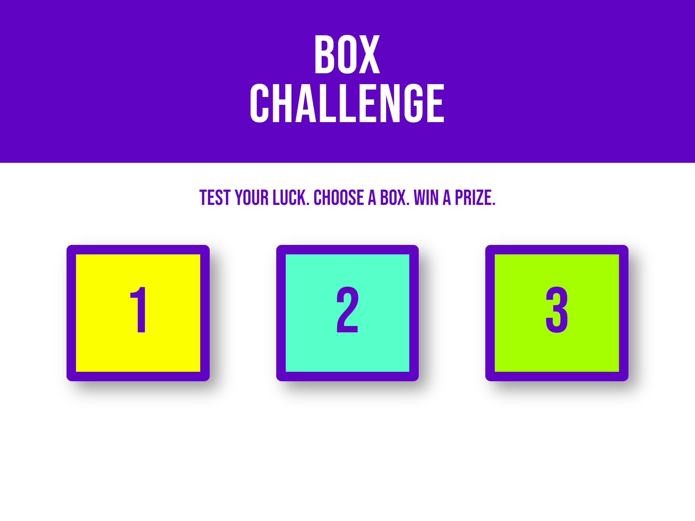

# Box Challenge

## Background

After completing the pizza ordering site, your boss has decided that you are ready for a bigger assignment.

You are being tasked with completing an interactive advertisement prototype for a new client. This app is meant to behave as follows:

1. App should be responsive at various screen sizes and match the images in the `mockups` folder.
1. When any of the boxes are clicked, the instructional text changes to inform the user if they've won or lost.
1. The winning box must be chosen at random with each click.
1. If the box clicked is a losing box, a random message informing the player she has lost must be displayed in the instructional text section.
1. The current number of wins and losses must be displayed below the boxes after a box is clicked.

One of your colleagues was slotted to complete the task, but she was pulled in different directions by other priorities and was not able to make much progress. She was able to complete the HTML, some of the CSS, and created a full set of mockups. She did not write any JavaScript, however she was able to comment out the steps to make the app functional in pseudo-code in the `index.js` file.

## Setup

Please create a git repository titled `m5-hw8-lastname-firstname` and clone the repo to your computer. Copy the files from the `unsolved` folder into the root directory of your repository folder.

## Instructions

Use the mockups found in the `mockups` folder to style the page according to the design provided. The CSS colors and font have been provided already.

In the `index.js` file you will need to complete the following steps:

1. Use the JS DOM API to target the `div#wins`, `div#losses`, and `p#message` HTML elements and store references to each in separate variables.
1. Create two variables, one to track wins and one for losses. Initialize them to `0`.
1. Target all `div.box` elements at the same time and use a loop (`for` or `forEach`) to apply a `click` event listener to all of them.
1. In the `click` event callback function:
  1. Determine which box was clicked using `textContent` and convert that value to a `Number`.
  1. Create a random number between 1-3 and store it to a variable.
  1. Determine if the random number matches the clicked box's number.
  1. In a loss, increment `losses` and display a random losing message
  1. In a win, increment `wins` and display the winning message
  1. Update the `div#wins` and `div#losses` elements to reflect the current win and loss count.

You will not need to add any markup to the `index.html` file.

## Deployment

Your code must be deployed to GitHub Pages. To deploy a repository to GitHub pages you must

1. Ensure your repository has an `index.html` file in the root directory.
1. Navigate to the `settings` section of the repository.
1. Click on `pages` in the left navigation menu.
1. Under `source` click the dropdown and select your `master` or `main` branch.
1. Click `save`.

Your site should be deployed to `<your github username>.github.io/<your repository name>` in 5-10 minutes.

## Submission

Please submit both a link to your repository and a link to the live site. Also please include any comments on stumbling blocks or difficulties encountered while completing the assignment.

## Resources

This assignment will test your ability to work with JavaScript's DOM API, as well as your ability to implement a responsive design using mockups.

W3 Schools Review:

[W3 has beginner friendly resources for the JavaScript DOM API](https://www.w3schools.com/js/js_htmldom.asp). Feel free to work down the list on the left if you would like to review the JS DOM API basics.

Additional MDN Resources:

- [querySelector](https://developer.mozilla.org/en-US/docs/Web/API/Document/querySelector)
- [querySelectorAll](https://developer.mozilla.org/en-US/docs/Web/API/Document/querySelectorAll)
- [getElementById](https://developer.mozilla.org/en-US/docs/Web/API/Document/getElementById)
- [textContent](https://developer.mozilla.org/en-US/docs/Web/API/Node/textContent)
- [addEventListener](https://developer.mozilla.org/en-US/docs/Web/API/EventTarget/addEventListener)
- [onclick](https://developer.mozilla.org/en-US/docs/Web/API/GlobalEventHandlers/onclick)
- [Event.target](https://developer.mozilla.org/en-US/docs/Web/API/Event/target)

Sources Used:

https://www.educba.com/css-drop-shadow/
https://www.codeinwp.com/snippets/add-event-listener-to-multiple-elements-with-javascript/ 
https://www.nickang.com/2018-03-06-add-event-listener-for-loop-problem-in-javascript/
https://www.w3docs.com/snippets/javascript/how-to-convert-string-to-number-in-javascript.html
https://www.w3schools.com/JS/js_random.asp
https://www.w3schools.com/js/js_datatypes.asp
https://herewecode.io/blog/get-random-element-array-javascript/